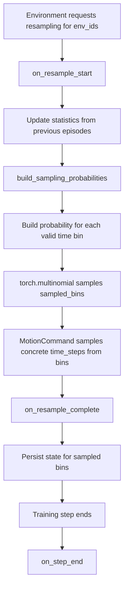
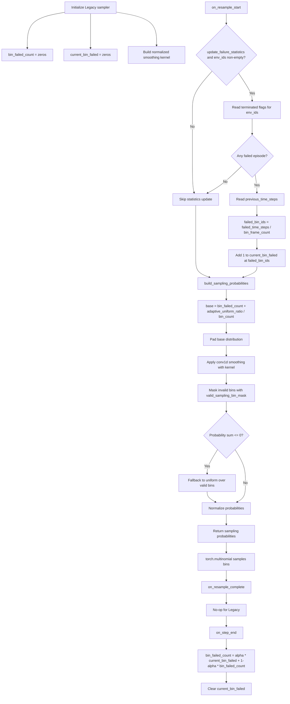
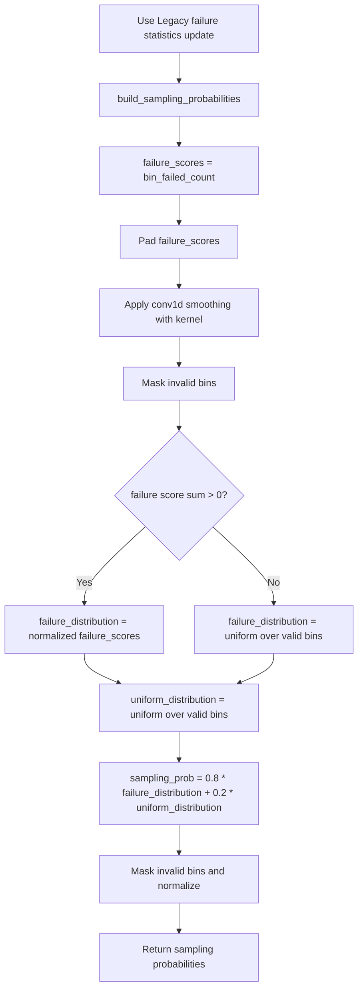
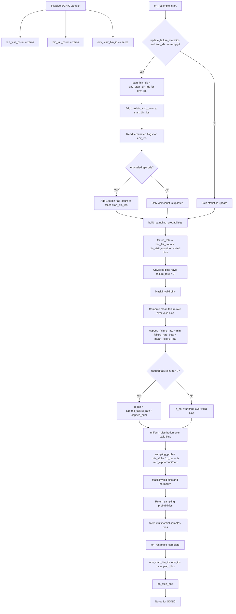
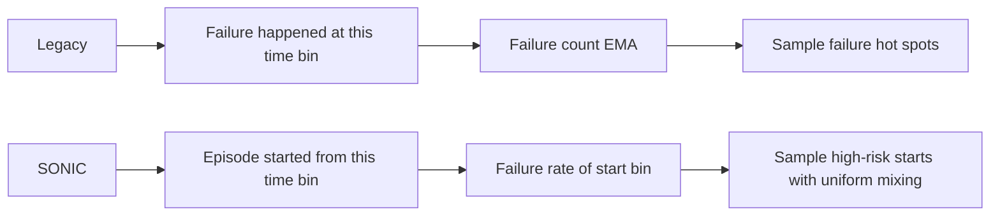

# Adaptive Sampling Flowcharts

本文档梳理 `LegacyBinAdaptiveSampling` 和 `SonicBinAdaptiveSampling` 的采样流程。

相关代码：

- `general_motion_tracker_whole_body_teleoperation/general_motion_tracker_whole_body_teleoperation/tasks/tracking/mdp/adaptive_sample.py`
- `general_motion_tracker_whole_body_teleoperation/general_motion_tracker_whole_body_teleoperation/tasks/tracking/mdp/commands.py`

## Common Lifecycle

两种采样器都实现同一套接口：

```text
on_resample_start -> build_sampling_probabilities -> torch.multinomial
-> on_resample_complete -> on_step_end
```



## LegacyBinAdaptiveSampling

核心思想：统计失败发生在哪些 time bin，并用失败次数的指数滑动平均作为之后的采样权重。失败越多的 bin，后续越容易被采样。

关键状态：

- `current_bin_failed`: 当前 step 收集到的失败 bin 计数。
- `bin_failed_count`: 跨 step 保留的失败统计，使用 EMA 更新。
- `kernel`: 对失败统计做邻域平滑的卷积核。

关键参数：

- `adaptive_alpha`: EMA 更新速度。
- `adaptive_uniform_ratio`: 加到失败统计上的均匀探索底噪，默认 `0.1`。
- `adaptive_kernel_size`: 平滑卷积核大小。
- `adaptive_lambda`: 平滑卷积核衰减系数。



### Legacy Summary

```text
Failure location -> current_bin_failed -> EMA bin_failed_count
-> add uniform offset -> smoothed probability -> sample bins
```

Legacy 关注“失败发生在哪个时间位置”。它更像一种基于失败热区的采样策略。

## StratifiedLegacyBinAdaptiveSampling

核心思想：继承 Legacy 的失败统计更新方式，但不改变原始 Legacy 行为；采样概率单独改成固定比例分层混合。默认配置下，`80%` 来自失败分布，`20%` 来自 valid bins 的均匀分布。

关键参数：

- `uniform_sampling_ratio`: 固定均匀采样比例，默认 `0.2`。
- 失败采样比例为 `1 - uniform_sampling_ratio`，默认 `0.8`。



### Stratified Legacy Summary

```text
Legacy failure statistics -> smoothed failure distribution
-> fixed 80/20 mix with uniform -> sample bins
```

## SonicBinAdaptiveSampling

核心思想：统计每个 episode 是从哪个 bin 开始的，以及从该起始 bin 开始后是否失败。采样时使用每个起始 bin 的失败率，而不是简单失败次数。

关键状态：

- `env_start_bin_ids`: 每个环境当前 episode 的起始 bin。
- `bin_visit_count`: 每个 bin 被作为起始 bin 的次数。
- `bin_fail_count`: 从每个 bin 开始后失败的次数。

关键参数：

- `mix_alpha`: 失败率分布和均匀分布的混合比例。
- `failure_cap_beta`: 失败率上限系数，用于抑制极端 bin 权重。



### Sonic Summary

```text
Episode start bin -> visit/fail counts -> failure rate
-> capped failure distribution -> mix with uniform -> sample bins
```

SONIC 关注“从哪个起始位置开始更容易失败”。它更像一种基于起点失败率的采样策略。

## Main Difference



简要对比：

| Item | LegacyBinAdaptiveSampling | StratifiedLegacyBinAdaptiveSampling | SonicBinAdaptiveSampling |
|---|---|---|---|
| 统计对象 | 失败发生的 bin | 失败发生的 bin | episode 起始 bin |
| 核心指标 | 失败次数 EMA | 失败次数 EMA | 起始 bin 失败率 |
| 是否记录 sampled_bins | 不记录 | 不记录 | 记录到 `env_start_bin_ids` |
| 是否在 `on_step_end` 更新 | 是，更新 EMA 并清零临时统计 | 是，继承 Legacy 更新 | 否 |
| 探索机制 | `adaptive_uniform_ratio` offset | 固定 `uniform_sampling_ratio=0.2` 均匀采样 | `(1 - mix_alpha) * uniform_distribution` |
| 平滑/约束 | `conv1d` kernel 平滑 | `conv1d` kernel 平滑 + 固定分层混合 | `failure_cap_beta` 限制极端失败率 |
